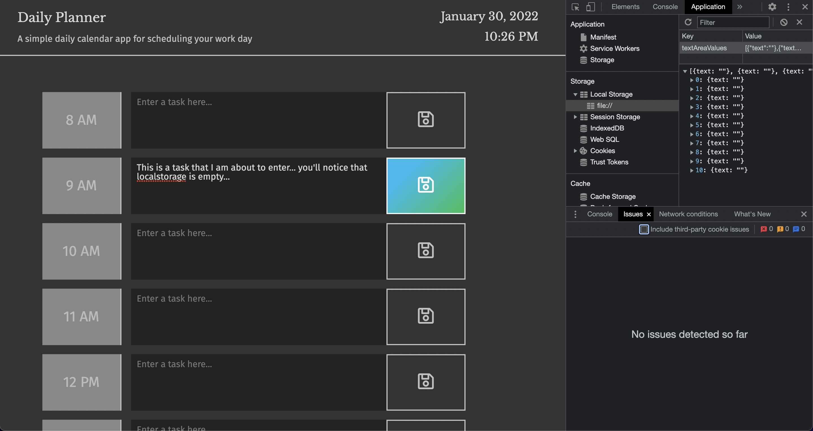
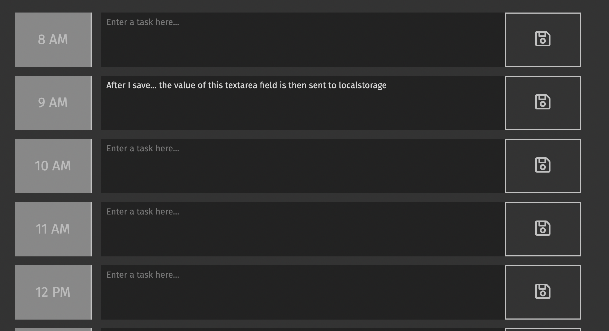
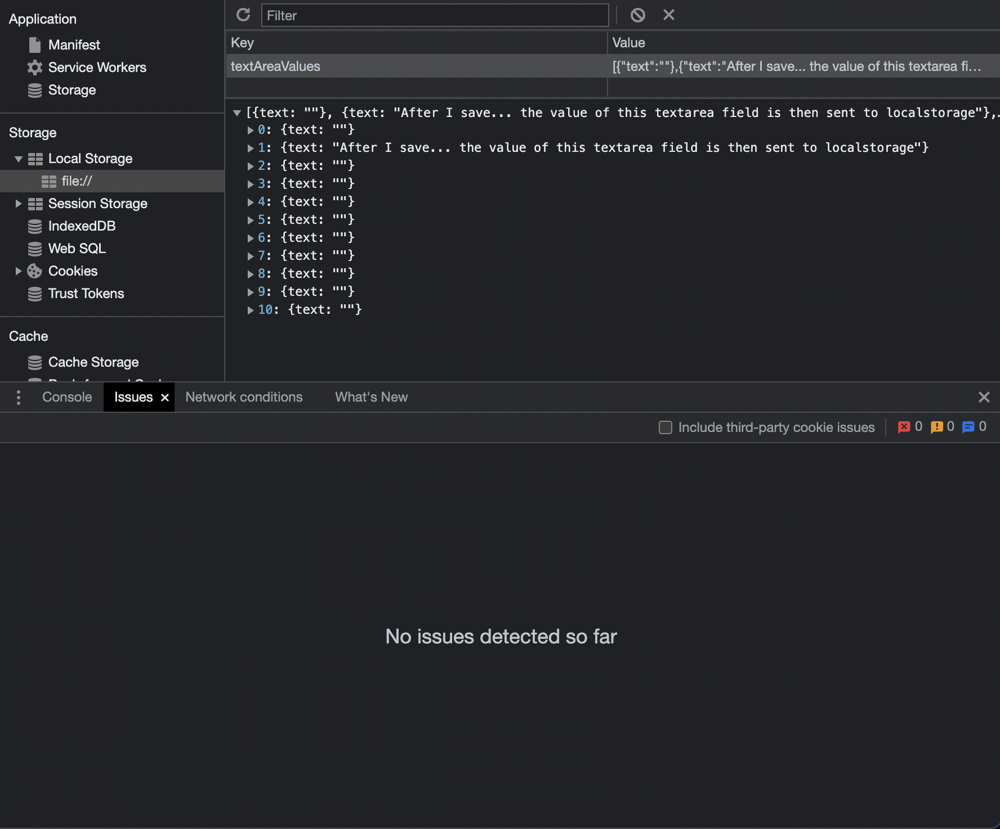
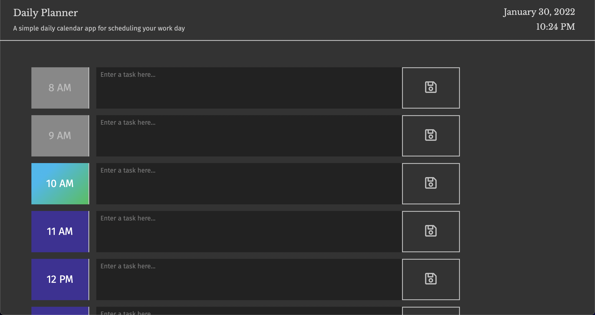

# Daily Planner App

This is a simple little application for planning your work day. You have the ability to create
tasks and to-dos for yourself. The beauty of this application is that the items you save to the corresponding time
wiil still be there even if you refresh the page!

This is done by saving the value of what you enter to localStorage in the browser. The only way your items could be lost, is if you manually clear your localStorage. 
 

## Link to Application

https://n-r-martin.github.io/day-planner-app/
 

## Technologies Used

* HTML5
* CSS3
* JavaScript
* MomentJS
 

## localStorage Demo
### Pre-Save:

 

### Post-Save UI:

 

### Post-Save localStorage Panel:

 

The clock also updates every minute using moment.js. This third-party library is also used to determine what the current hour is so it can style the time blocks based on whether they are current, in the past, or in the future. 
 

### Example of Time Block Color Coding:

 

## License

MIT License

Copyright (c) 2022 Nick Martin

Permission is hereby granted, free of charge, to any person obtaining a copy
of this software and associated documentation files (the "Software"), to deal
in the Software without restriction, including without limitation the rights
to use, copy, modify, merge, publish, distribute, sublicense, and/or sell
copies of the Software, and to permit persons to whom the Software is
furnished to do so, subject to the following conditions:

The above copyright notice and this permission notice shall be included in all
copies or substantial portions of the Software.

THE SOFTWARE IS PROVIDED "AS IS", WITHOUT WARRANTY OF ANY KIND, EXPRESS OR
IMPLIED, INCLUDING BUT NOT LIMITED TO THE WARRANTIES OF MERCHANTABILITY,
FITNESS FOR A PARTICULAR PURPOSE AND NONINFRINGEMENT. IN NO EVENT SHALL THE
AUTHORS OR COPYRIGHT HOLDERS BE LIABLE FOR ANY CLAIM, DAMAGES OR OTHER
LIABILITY, WHETHER IN AN ACTION OF CONTRACT, TORT OR OTHERWISE, ARISING FROM,
OUT OF OR IN CONNECTION WITH THE SOFTWARE OR THE USE OR OTHER DEALINGS IN THE
SOFTWARE.
 

## Contact

* hello@nickmartin.design
* 720.409.0852